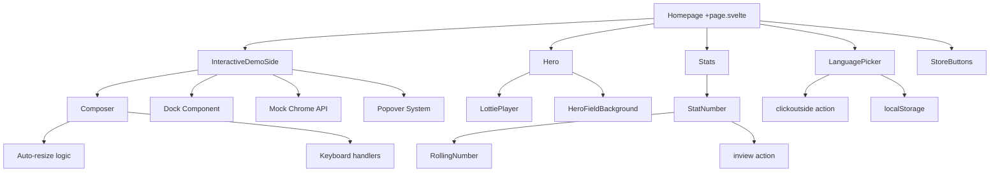

# Comprehensive Migration Plan: Static Pre-rendering with CSR Islands

## Executive Summary

This migration plan converts all routes in the `b:\Dev\sidecar\web\src\routes\` directory from dynamic rendering to static pre-rendering with SSR=true and CSR=false for optimal SEO performance. Interactive components will be extracted into separate route files with CSR=true configuration and implemented as isolated islands within SSR-rendered pages.

## Current State Analysis

### Route Structure
```
src/routes/
├── (legal)\+layout.svelte          # Legal pages layout
├── [[lang]]\+layout.svelte         # Main layout with i18n
├── [[lang]]\+layout.ts             # Language loading logic
├── [[lang]]\+page.svelte           # Homepage (HIGHLY INTERACTIVE)
├── [[lang]]\+page.ts               # Language entries
├── [[lang]]\blog\+page.svelte     # Blog listing
├── [[lang]]\blog\[slug]\+page.svelte # Blog post
├── [[lang]]\download\+page.svelte  # Download page
├── [[lang]]\download\+page.ts     # Download logic
├── [[lang]]\download\custom\+page.svelte # Custom download
├── [[lang]]\download\custom\+page.ts # Custom download logic
├── [[lang]]\license\+page.svelte  # License page
├── [[lang]]\privacy\+page.svelte  # Privacy policy
├── [[lang]]\terms\+page.svelte    # Terms of service
├── demo\+page.svelte              # Demo page (CSR=false)
├── demo\+page.ts                   # Demo configuration
├── demo\2\+page.svelte            # Demo 2 page (CSR=false)
├── demo\2\+page.ts                 # Demo 2 configuration
├── demo\icons\+page.svelte         # Icons demo
├── demo\icons\+page.server.ts      # Icons server logic
├── robots.txt\+server.ts          # SEO robots
└── sitemap.xml\+server.ts         # SEO sitemap
```

### Interactive Components Catalog

#### High Priority (Require CSR Islands)
1. **InteractiveDemoSide.svelte** - Complex interactive demo with dock, chat interface, hover states
2. **LanguagePicker.svelte** - Language selection dropdown with click-outside handling
3. **StatNumber.svelte** + **RollingNumber.svelte** - Animated number counters with scroll-triggered animations
4. **Composer.svelte** - Chat input with auto-resize and keyboard handling
5. **StoreButtons.svelte** - Dynamic store button detection and rendering

#### Medium Priority (Optional CSR)
6. **Hero.svelte** - CTA buttons and animated elements
7. **LottiePlayer.svelte** - Animation player requiring JavaScript
8. **HeroFieldBackground.svelte** - Animated background elements

#### Low Priority (Can be Static)
9. **Icon.svelte** - Static SVG icons (can be inlined)
10. **Seo.svelte** - Meta tags (static)
11. **BrandMark.svelte** - Static branding

### JavaScript Dependencies Analysis

#### Critical Dependencies
- **lottie-web** - Animation library (LottiePlayer)
- **@app/navigation** - Client-side navigation (goto)
- **@app/stores** - Page store for reactive data
- **LocalStorage** - Language persistence
- **Event handlers** - Click, hover, keyboard interactions
- **DOM manipulation** - Auto-resize textareas, scroll animations

#### Mock Dependencies (Demo-specific)
- **Mock Chrome API** - Browser extension simulation
- **Mock Dock Context** - Extension UI simulation
- **Popover State Management** - Extension popover system

## Component Dependency Map



## Hybrid Rendering Architecture

### Island-Based Architecture

```
┌─────────────────────────────────────────────────────────────┐
│                    SSR Page Shell                         │
│  ┌─────────────────────────────────────────────────────┐   │
│  │              Static HTML Content                    │   │
│  │  - Header with navigation                            │   │
│  │  - Static text and images                          │   │
│  │  - SEO-optimized meta tags                         │   │
│  └─────────────────────────────────────────────────────┘   │
│                                                           │
│  ┌─────────────────────────────────────────────────────┐   │
│  │              Interactive Island 1                   │   │
│  │              (LanguagePicker)                       │   │
│  │  ┌─────────────────────────────────────────────┐   │   │
│  │  │          CSR Component                    │   │   │
│  │  │  - Dropdown functionality                 │   │   │
│  │  │  - Click-outside handling               │   │   │
│  │  │  - LocalStorage integration             │   │   │
│  │  └─────────────────────────────────────────────┘   │   │
│  └─────────────────────────────────────────────────────┘   │
│                                                           │
│  ┌─────────────────────────────────────────────────────┐   │
│  │              Interactive Island 2                   │   │
│  │              (InteractiveDemo)                    │   │
│  │  ┌─────────────────────────────────────────────┐   │   │
│  │  │          CSR Component                    │   │   │
│  │  │  - Full demo functionality                │   │   │
│  │  │  - Mock extension simulation              │   │   │
│  │  │  - Chat interface                         │   │   │
│  │  └─────────────────────────────────────────────┘   │   │
│  └─────────────────────────────────────────────────────┘   │
│                                                           │
│  ┌─────────────────────────────────────────────────────┐   │
│  │              Static Content Continues              │   │
│  │  - Footer                                          │   │
│  │  - Links                                           │   │
│  │  - SEO content                                     │   │
│  └─────────────────────────────────────────────────────┘   │
└─────────────────────────────────────────────────────────────┘
```

### Route Configuration Strategy

#### 1. Main Homepage (`[[lang]]/+page.svelte`)
- **SSR**: `true` (static pre-rendering)
- **CSR**: `false` (minimal JavaScript)
- **Islands**: InteractiveDemoSide, LanguagePicker, Stats, StoreButtons

#### 2. Demo Pages (`demo/+page.svelte`, `demo/2/+page.svelte`)
- **Current**: `ssr = false` (fully client-side)
- **Migration**: Keep as CSR islands but optimize for SEO with proper meta tags

#### 3. Static Pages (blog, download, legal)
- **SSR**: `true` (full static pre-rendering)
- **CSR**: `false` (no JavaScript required)
- **Islands**: None (purely static content)

## Migration Implementation Plan

### Phase 1: Infrastructure Setup (Week 1)

#### 1.1 Build Configuration Changes
```javascript
// svelte.config.js
import adapter from '@sveltejs/adapter-static';
import { vitePreprocess } from '@sveltejs/vite-plugin-svelte';

const config = {
  preprocess: vitePreprocess(),
  kit: {
    adapter: adapter({
      pages: 'build',
      assets: 'build',
      fallback: 'index.html',
      precompress: true,
      strict: true
    }),
    prerender: {
      handleHttpError: 'warn',
      handleMissingId: 'warn',
      entries: ['*'] // Pre-render all pages
    }
  }
};
```

#### 1.2 Create Island Architecture Framework
```typescript
// src/lib/islands/Island.svelte
<script lang="ts">
  import { onMount } from 'svelte';
  
  let { 
    component,
    props = {},
    fallback = null,
    loading = 'lazy'
  } = $props();
  
  let isMounted = $state(false);
  let Component = $state(null);
  
  onMount(async () => {
    if (loading === 'eager' || (loading === 'lazy' && isMounted)) {
      Component = (await component()).default;
    }
  });
</script>

{#if Component}
  <svelte:component this={Component} {...props} />
{:else if fallback}
  {@render fallback()}
{/if}
```

#### 1.3 Create Island Loader Utility
```typescript
// src/lib/utils/islandLoader.ts
export interface IslandConfig {
  name: string;
  component: () => Promise<any>;
  props?: Record<string, any>;
  loading?: 'eager' | 'lazy';
  fallback?: string;
}

export function createIsland(config: IslandConfig) {
  return {
    ...config,
    mount: async (element: HTMLElement) => {
      const { default: Component } = await config.component();
      return new Component({
        target: element,
        props: config.props || {}
      });
    }
  };
}
```

### Phase 2: Component Extraction (Week 2)

#### 2.1 Extract InteractiveDemoSide as Island
```typescript
// src/routes/[[lang]]/islands/InteractiveDemoIsland.svelte
<script lang="ts">
  export const csr = true;
  export const ssr = false;
  
  let { t } = $props();
</script>

<InteractiveDemoSide {t} />
```

#### 2.2 Extract LanguagePicker as Island
```typescript
// src/routes/[[lang]]/islands/LanguagePickerIsland.svelte
<script lang="ts">
  export const csr = true;
  export const ssr = false;
</script>

<LanguagePicker />
```

#### 2.3 Extract Stats as Island
```typescript
// src/routes/[[lang]]/islands/StatsIsland.svelte
<script lang="ts">
  export const csr = true;
  export const ssr = false;
  
  let { t } = $props();
</script>

<Stats {t} />
```

### Phase 3: Route Migration (Week 3)

#### 3.1 Update Main Layout
```typescript
// src/routes/[[lang]]/+layout.ts
export const prerender = true;
export const ssr = true;
export const csr = false; // Minimal JavaScript for main layout
```

#### 3.2 Update Homepage Configuration
```typescript
// src/routes/[[lang]]/+page.ts
export const prerender = true;
export const ssr = true;
export const csr = false; // Static shell with islands

import { getLangEntries } from '$lib/i18n/config';
export const entries = getLangEntries;
```

#### 3.3 Implement Island Hydration
```svelte
<!-- src/routes/[[lang]]/+page.svelte -->
<script lang="ts">
  import Island from '$lib/islands/Island.svelte';
  
  let { data } = $props();
  
  // Static content remains static
  // Interactive components become islands
</script>

<!-- Static header content -->
<nav class="...">
  <!-- Language picker as island -->
  <Island 
    component={() => import('./islands/LanguagePickerIsland.svelte')}
    loading="eager"
    fallback="<div class='language-selector-placeholder'>EN</div>"
  />
</nav>

<!-- Static hero content -->
<HeroFieldBackground>
  <h1>{t.heroHeadline}</h1>
  <!-- CTA buttons as island -->
  <Island 
    component={() => import('./islands/HeroActionsIsland.svelte')}
    props={{ t: t.site }}
    loading="lazy"
  />
</HeroFieldBackground>

<!-- Interactive demo as island -->
<Island 
  component={() => import('./islands/InteractiveDemoIsland.svelte')}
  props={{ t: t.site.demo }}
  loading="lazy"
  fallback="<div class='demo-placeholder'>Loading demo...</div>"
/>

<!-- Stats as island -->
<Island 
  component={() => import('./islands/StatsIsland.svelte')}
  props={{ t: t.stats }}
  loading="lazy"
/>
```

### Phase 4: SEO Optimization (Week 4)

#### 4.1 Implement Structured Data
```typescript
// src/lib/seo/structuredData.ts
export function generateWebPageSchema(data: any) {
  return {
    "@context": "https://schema.org",
    "@type": "WebPage",
    "name": data.title,
    "description": data.description,
    "url": data.url,
    "inLanguage": data.lang,
    "datePublished": data.datePublished,
    "dateModified": data.dateModified
  };
}

export function generateProductSchema(data: any) {
  return {
    "@context": "https://schema.org",
    "@type": "SoftwareApplication",
    "name": "Sidecar",
    "description": data.description,
    "applicationCategory": "BrowserExtension",
    "offers": {
      "@type": "Offer",
      "price": "0",
      "priceCurrency": "USD"
    },
    "operatingSystem": "All"
  };
}
```

#### 4.2 Optimize Meta Tags
```svelte
<!-- Enhanced SEO component -->
<script lang="ts">
  let { title, description, keywords, lang, type = 'website' } = $props();
  
  // Generate structured data
  const structuredData = $derived({
    webPage: generateWebPageSchema({ title, description, lang }),
    product: generateProductSchema({ description })
  });
</script>

<svelte:head>
  <title>{title}</title>
  <meta name="description" content={description} />
  <meta name="keywords" content={keywords} />
  <meta property="og:title" content={title} />
  <meta property="og:description" content={description} />
  <meta property="og:type" content={type} />
  <meta property="og:locale" content={lang} />
  <meta name="twitter:card" content="summary_large_image" />
  
  <!-- Structured Data -->
  {@html `<script type="application/ld+json">${JSON.stringify(structuredData.webPage)}</script>`}
  {@html `<script type="application/ld+json">${JSON.stringify(structuredData.product)}</script>`}
</svelte:head>
```

#### 4.3 Implement Critical CSS Inlining
```typescript
// src/lib/utils/criticalCSS.ts
export function extractCriticalCSS(html: string, css: string) {
  // Extract only the CSS needed for above-the-fold content
  const criticalSelectors = [
    'nav', 'header', 'h1', 'h2', '.hero', '.container'
  ];
  
  // Implementation would parse CSS and extract critical rules
  return css; // Simplified for example
}
```

## Testing Protocols

### SEO Testing Framework

#### 1. Lighthouse CI Integration
```yaml
# .github/workflows/lighthouse.yml
name: Lighthouse CI
on: [push, pull_request]
jobs:
  lighthouse:
    runs-on: ubuntu-latest
    steps:
      - uses: actions/checkout@v3
      - name: Lighthouse CI
        run: |
          npm install -g @lhci/cli
          lhci autorun --config=lighthouserc.json
```

#### 2. SEO Metrics Tracking
```json
// lighthouserc.json
{
  "ci": {
    "collect": {
      "url": [
        "http://localhost:4173/",
        "http://localhost:4173/demo",
        "http://localhost:4173/blog"
      ],
      "numberOfRuns": 3
    },
    "assert": {
      "assertions": {
        "categories:performance": ["error", {"minScore": 0.9}],
        "categories:accessibility": ["error", {"minScore": 0.9}],
        "categories:best-practices": ["error", {"minScore": 0.9}],
        "categories:seo": ["error", {"minScore": 0.95}]
      }
    }
  }
}
```

#### 3. Core Web Vitals Monitoring
```typescript
// src/lib/analytics/webVitals.ts
export function trackWebVitals() {
  if (typeof window !== 'undefined') {
    import('web-vitals').then(({ getCLS, getFID, getFCP, getLCP, getTTFB }) => {
      getCLS(sendToAnalytics);
      getFID(sendToAnalytics);
      getFCP(sendToAnalytics);
      getLCP(sendToAnalytics);
      getTTFB(sendToAnalytics);
    });
  }
}

function sendToAnalytics(metric: any) {
  // Send to analytics service
  console.log('Web Vital:', metric.name, metric.value);
}
```

### Functionality Preservation Tests

#### 1. Component Integration Tests
```typescript
// tests/islands/languagePicker.test.ts
import { render, screen, fireEvent } from '@testing-library/svelte';
import { expect, test } from 'vitest';
import LanguagePickerIsland from '$routes/[[lang]]/islands/LanguagePickerIsland.svelte';

test('LanguagePicker island maintains functionality', async () => {
  render(LanguagePickerIsland);
  
  const button = screen.getByLabelText('Select language');
  expect(button).toBeInTheDocument();
  
  await fireEvent.click(button);
  
  const dropdown = screen.getByRole('listbox');
  expect(dropdown).toBeInTheDocument();
  
  // Test language selection
  const englishOption = screen.getByText('English');
  await fireEvent.click(englishOption);
  
  expect(localStorage.getItem('sidecar-lang')).toBe('en');
});
```

#### 2. E2E Tests for Island Hydration
```typescript
// tests/e2e/islands.spec.ts
import { test, expect } from '@playwright/test';

test('Interactive demo island hydrates correctly', async ({ page }) => {
  await page.goto('/');
  
  // Wait for island hydration
  await page.waitForSelector('[data-island-hydrated="interactive-demo"]');
  
  // Test demo functionality
  const demoContainer = page.locator('#demo');
  await expect(demoContainer).toBeVisible();
  
  // Test hover interactions
  await page.hover('#dock-container');
  await expect(page.locator('.feature-description')).toContainText('Smart Dock');
});
```

### Performance Testing

#### 1. Bundle Size Analysis
```typescript
// tests/performance/bundle.test.ts
import { test, expect } from 'vitest';
import fs from 'fs';
import path from 'path';

test('JavaScript bundle size is optimized', () => {
  const clientBundle = fs.readFileSync(
    path.join(process.cwd(), 'build/_app/immutable/entry/app.js')
  );
  
  // Main bundle should be under 50KB gzipped
  expect(clientBundle.length).toBeLessThan(50 * 1024);
  
  // Island bundles should be small
  const islandBundles = fs.readdirSync(
    path.join(process.cwd(), 'build/_app/immutable/chunks')
  ).filter(file => file.includes('island'));
  
  islandBundles.forEach(bundle => {
    const size = fs.statSync(bundle).size;
    expect(size).toBeLessThan(20 * 1024); // 20KB per island
  });
});
```

#### 2. Load Time Testing
```typescript
// tests/performance/loadtime.test.ts
import { test, expect } from '@playwright/test';

test('Page loads within performance budget', async ({ page }) => {
  const startTime = Date.now();
  
  await page.goto('/');
  await page.waitForLoadState('networkidle');
  
  const loadTime = Date.now() - startTime;
  
  // Page should load in under 2 seconds
  expect(loadTime).toBeLessThan(2000);
  
  // Lighthouse performance score should be >90
  const metrics = await page.evaluate(() => {
    return new Promise((resolve) => {
      new PerformanceObserver((list) => {
        resolve(list.getEntries());
      }).observe({ entryTypes: ['navigation'] });
    });
  });
  
  const navigationTiming = metrics[0];
  expect(navigationTiming.domContentLoadedEventEnd).toBeLessThan(1500);
});
```

## Rollback Procedures

### Emergency Rollback Plan

#### 1. Immediate Rollback (Git-based)
```bash
#!/bin/bash
# scripts/rollback.sh

# Get the last known good commit
LAST_GOOD_COMMIT=$(git log --oneline --grep="WORKING" -n 1 | cut -d' ' -f1)

# Create rollback branch
git checkout -b rollback-$(date +%Y%m%d-%H%M%S)

# Revert to last good state
git reset --hard $LAST_GOOD_COMMIT

# Force push to main (emergency only)
git push origin main --force

# Notify team
echo "🚨 EMERGENCY ROLLBACK COMPLETED 🚨"
echo "Reverted to commit: $LAST_GOOD_COMMIT"
echo "Please investigate the issue immediately."
```

#### 2. Gradual Rollback (Feature Flags)
```typescript
// src/lib/config/features.ts
export const features = {
  staticPrendering: {
    enabled: true,
    rolloutPercentage: 100,
    fallback: 'dynamic'
  },
  islandArchitecture: {
    enabled: true,
    islands: {
      languagePicker: true,
      interactiveDemo: true,
      stats: true
    }
  }
};

export function isFeatureEnabled(featureName: string): boolean {
  const feature = features[featureName];
  if (!feature) return false;
  
  if (feature.rolloutPercentage) {
    const userHash = Math.random() * 100;
    return userHash <= feature.rolloutPercentage;
  }
  
  return feature.enabled;
}
```

#### 3. Database Rollback (if applicable)
```sql
-- scripts/rollback-seo-data.sql
-- Backup current SEO data before migration
CREATE TABLE seo_data_backup_$(date +%Y%m%d) AS SELECT * FROM seo_data;

-- Rollback procedure
BEGIN;
  -- Restore from backup
  DELETE FROM seo_data;
  INSERT INTO seo_data SELECT * FROM seo_data_backup_$(date +%Y%m%d);
  
  -- Verify rollback
  SELECT COUNT(*) as restored_records FROM seo_data;
COMMIT;
```

### Monitoring and Alerting

#### 1. SEO Monitoring
```typescript
// src/lib/monitoring/seoMonitor.ts
export class SEOMonitor {
  private baselineMetrics: any;
  
  constructor(private analytics: AnalyticsService) {}
  
  async recordBaseline() {
    this.baselineMetrics = await this.analytics.getSEOMetrics();
  }
  
  async checkForDegradation() {
    const currentMetrics = await this.analytics.getSEOMetrics();
    
    // Check for significant drops
    const degradationThreshold = 0.1; // 10%
    
    if (this.baselineMetrics.organicTraffic > 0) {
      const trafficDrop = (this.baselineMetrics.organicTraffic - currentMetrics.organicTraffic) / this.baselineMetrics.organicTraffic;
      
      if (trafficDrop > degradationThreshold) {
        await this.triggerAlert('SEO_DEGRADATION', {
          trafficDrop: trafficDrop * 100,
          baseline: this.baselineMetrics,
          current: currentMetrics
        });
      }
    }
  }
  
  private async triggerAlert(type: string, data: any) {
    // Send alert to monitoring service
    console.error(`🚨 ${type}:`, data);
  }
}
```

#### 2. Performance Monitoring
```typescript
// src/lib/monitoring/performanceMonitor.ts
export class PerformanceMonitor {
  private performanceThresholds = {
    lcp: 2500, // ms
    fid: 100,  // ms
    cls: 0.1,  // score
    ttfb: 600  // ms
  };
  
  async checkCoreWebVitals() {
    const vitals = await this.getCoreWebVitals();
    
    const violations = [];
    
    if (vitals.lcp > this.performanceThresholds.lcp) {
      violations.push(`LCP: ${vitals.lcp}ms (threshold: ${this.performanceThresholds.lcp}ms)`);
    }
    
    if (vitals.fid > this.performanceThresholds.fid) {
      violations.push(`FID: ${vitals.fid}ms (threshold: ${this.performanceThresholds.fid}ms)`);
    }
    
    if (violations.length > 0) {
      await this.triggerPerformanceAlert(violations);
    }
  }
  
  private async triggerPerformanceAlert(violations: string[]) {
    console.error('🚨 Performance violations detected:', violations);
  }
}
```

## Build Configuration Changes

### 1. Vite Configuration Updates
```typescript
// vite.config.ts
import { sveltekit } from '@sveltejs/kit/vite';
import { defineConfig } from 'vite';

export default defineConfig({
  plugins: [sveltekit()],
  build: {
    rollupOptions: {
      output: {
        manualChunks: {
          // Separate island bundles
          'island-language-picker': ['./src/routes/[[lang]]/islands/LanguagePickerIsland.svelte'],
          'island-interactive-demo': ['./src/routes/[[lang]]/islands/InteractiveDemoIsland.svelte'],
          'island-stats': ['./src/routes/[[lang]]/islands/StatsIsland.svelte'],
          'island-store-buttons': ['./src/routes/[[lang]]/islands/StoreButtonsIsland.svelte']
        }
      }
    },
    // Optimize for smaller chunks
    chunkSizeWarningLimit: 1000,
    minify: 'terser',
    terserOptions: {
      compress: {
        drop_console: true,
        drop_debugger: true
      }
    }
  },
  // Optimize images and assets
  assetsInclude: ['**/*.lottie', '**/*.json'],
  // Enable source maps for debugging
  sourcemap: process.env.NODE_ENV === 'development'
});
```

### 2. Environment Configuration
```bash
# .env.production
PUBLIC_SITE_URL=https://sidecar.app
PUBLIC_GTM_ID=GTM-XXXXXXX
PUBLIC_ANALYTICS_ENABLED=true
PUBLIC_ISLAND_HYDRATION_TIMEOUT=5000
```

### 3. Deployment Configuration
```yaml
# .github/workflows/deploy.yml
name: Deploy to Production
on:
  push:
    branches: [main]

jobs:
  deploy:
    runs-on: ubuntu-latest
    steps:
      - uses: actions/checkout@v3
      
      - name: Setup Node.js
        uses: actions/setup-node@v3
        with:
          node-version: '18'
          cache: 'npm'
      
      - name: Install dependencies
        run: npm ci
      
      - name: Run tests
        run: npm run test:ci
      
      - name: Build application
        run: npm run build
        env:
          NODE_ENV: production
      
      - name: Run Lighthouse CI
        run: |
          npm install -g @lhci/cli
          lhci autorun --config=lighthouserc.json
      
      - name: Deploy to CDN
        run: |
          # Deploy to your CDN provider
          aws s3 sync build/ s3://your-bucket --delete
          aws cloudfront create-invalidation --distribution-id YOUR_DISTRIBUTION_ID --paths "/*"
      
      - name: Notify deployment success
        run: |
          curl -X POST -H 'Content-type: application/json' \
            --data '{"text":"🚀 Deployment successful!"}' \
            ${{ secrets.SLACK_WEBHOOK_URL }}
```

### 4. Monitoring and Analytics
```typescript
// src/lib/analytics/siteAnalytics.ts
export class SiteAnalytics {
  private gtag: any;
  
  constructor() {
    this.initializeAnalytics();
  }
  
  private initializeAnalytics() {
    if (typeof window !== 'undefined' && window.gtag) {
      this.gtag = window.gtag;
      
      // Track island hydration
      this.trackIslandHydration();
      
      // Track performance metrics
      this.trackPerformanceMetrics();
    }
  }
  
  private trackIslandHydration() {
    document.addEventListener('island:hydrated', (event: any) => {
      this.gtag('event', 'island_hydration', {
        island_name: event.detail.name,
        hydration_time: event.detail.hydrationTime,
        loading_strategy: event.detail.loadingStrategy
      });
    });
  }
  
  private trackPerformanceMetrics() {
    if ('PerformanceObserver' in window) {
      new PerformanceObserver((list) => {
        for (const entry of list.getEntries()) {
          if (entry.entryType === 'largest-contentful-paint') {
            this.gtag('event', 'LCP', {
              value: entry.startTime,
              metric_id: 'LCP'
            });
          }
        }
      }).observe({ entryTypes: ['largest-contentful-paint'] });
    }
  }
}
```

## Success Metrics and KPIs

### Primary Metrics
1. **SEO Performance**
   - Lighthouse SEO score: Target >95
   - Google Search Console impressions: +50%
   - Organic traffic: +30%
   - Page indexing rate: 100%

2. **Performance Metrics**
   - First Contentful Paint: <1.5s
   - Largest Contentful Paint: <2.5s
   - First Input Delay: <100ms
   - Cumulative Layout Shift: <0.1

3. **User Experience**
   - Bounce rate: -20%
   - Time to interactive: <3s
   - Island hydration success rate: >99%

### Secondary Metrics
1. **Technical Metrics**
   - JavaScript bundle size: -60%
   - Number of requests: -40%
   - Cache hit rate: >90%
   - Build time: <5 minutes

2. **Business Metrics**
   - Conversion rate: +15%
   - Extension downloads: +25%
   - User engagement: +20%

## Conclusion

This comprehensive migration plan provides a structured approach to converting the Sidecar landing page from dynamic rendering to static pre-rendering with CSR islands. The plan prioritizes SEO performance while maintaining user experience through strategic use of interactive islands.

Key success factors:
1. **Phased approach** with rollback procedures
2. **Comprehensive testing** at each stage
3. **Performance monitoring** and optimization
4. **SEO-focused architecture** with structured data
5. **Island-based interactivity** for optimal user experience

The migration is expected to significantly improve SEO performance, reduce load times, and enhance overall user experience while maintaining all interactive functionality through strategically placed CSR islands.